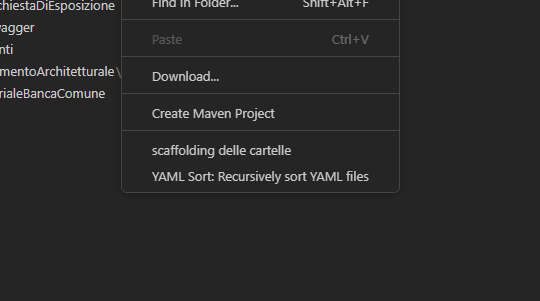

# bbpm-helper README

Quasta estensione serve per fornire comportamenti aggiuntivi per il gruppo "supporto progetti" di Imola Informatica che segue Banco BPM

## Features

### Scaffolding cartelle

## Requirements

Nessun requirement particolare

## Extension Settings

TBI
## Known Issues

...
## Release Notes

...

### 1.0.0

Initial release of BBPM-Helper

